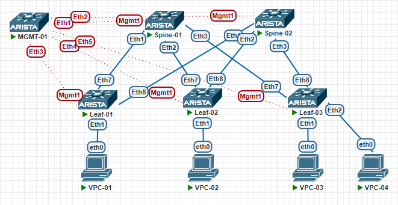

# Проектирование адресного пространства

## Цели работ

1. Собрать топологию CLOS, как на схеме:\

2. Распределить адресное пространство для Underlay сети
3. Зафиксировать план работ и адресное пространство

## Выполнение Работ

### Топология CLOS

Реализованная схема:\

### Адресное пространство

Пространство выделялось из сети 10.0.0.0/8: \
P2P сети строились по схеме: \
10.XY.Z.0/30

Лупбеки по схеме: \
10.XY.255.1/32 Для маршрутизации \
10.10.255.1/32 Для точки рандеву \
10.20Y.1.1/32 Для VTEP лупбека на Leaf коммутаторах

Где: \
X - ряд коммутаторов. 1 - Spine, 2 - Leaf \
Y - Номер коммутатора в ряду \
Z - Номер Downlink/Uplink коммутатора

|Device|Interface|Vlan/IP Address/Mask|
|---|---|---|
|MGMT-01|Ethernet1|Access Vlan 255|
|MGMT-01|Ethernet2|Access Vlan 255|
|MGMT-01|Ethernet3|Access Vlan 255|
|MGMT-01|Ethernet4|Access Vlan 255|
|MGMT-01|Ethernet5|Access Vlan 255|
|MGMT-01|Vlan 255|10.255.1.254/24|

|Device|Interface|IP Address/Mask|
|---|---|---|
|Spine-01|Ethernet1|10.11.1.1/30|
|Spine-01|Ethernet2|10.11.2.1/30|
|Spine-01|Ethernet3|10.11.3.1/30|
|Spine-01|Loopback1|10.11.255.1/32|
|Spine-01|Loopback255|10.10.255.1/32|
|Spine-01|Management1|10.255.1.1/24|

|Device|Interface|IP Address/Mask|
|---|---|---|
|Spine-02|Ethernet1|10.12.1.1/30|
|Spine-02|Ethernet2|10.12.2.1/30|
|Spine-02|Ethernet3|10.12.3.1/30|
|Spine-02|Loopback1|10.12.255.1/32|
|Spine-02|Loopback255|10.10.255.1/32|
|Spine-02|Management1|10.255.1.2/24|

|Device|Interface|IP Address/Mask|
|---|---|---|
|Leaf-01|Ethernet1|Access Vlan 11|
|Leaf-01|Ethernet7|10.11.1.2/30|
|Leaf-01|Ethernet8|10.12.1.2/30|
|Leaf-01|Loopback1|10.21.255.1/32|
|Leaf-01|Loopback2|10.201.1.1/32|
|Leaf-01|Management1|10.255.1.11/24|

|Device|Interface|IP Address/Mask|
|---|---|---|
|Leaf-02|Ethernet1|Access Vlan 11|
|Leaf-02|Ethernet7|10.11.2.2/30|
|Leaf-02|Ethernet8|10.12.2.2/30|
|Leaf-02|Loopback1|10.22.255.1/32|
|Leaf-02|Loopback2|10.202.1.1/32|
|Leaf-02|Management1|10.255.1.12/24|

|Device|Interface|IP Address/Mask|
|---|---|---|
|Leaf-03|Ethernet1|Access Vlan 11|
|Leaf-03|Ethernet7|10.11.3.2/30|
|Leaf-03|Ethernet8|10.12.3.2/30|
|Leaf-03|Loopback1|10.23.255.1/32|
|Leaf-03|Loopback2|10.203.1.1/32|
|Leaf-03|Management1|10.255.1.13/24|

### VLAN Таблица

|VLAN|Название|Связанные интерфейсы|Описание|
|---|---|---|---|
|255|MGMT|MGMT-01: Eth1-5| Для подключения к коммутаторам внутри фабрики с коммутатора MGMT-01. Сеть 10.255.1.0/24|
|11|Clients|Leaf-01,02,03:Eth1|Клиентское подключение|

### Конфигурация портов

Spine-01

 
interface Ethernet1
   description --- Leaf-01 ---
   no switchport
   ip address 10.11.1.1/30
 
interface Ethernet2
   description --- Leaf-02 ---
   no switchport
   ip address 10.11.2.1/30
 
interface Ethernet3
   description --- Leaf-03 ---
   no switchport
   ip address 10.11.3.1/30
 
interface Loopback0
   description --- For Routing ---
   ip address 10.11.255.1/32
 
interface Loopback255
   description --- Rendezvous Point ---
   ip address 10.10.255.1/32
 
interface Management1
   vrf MGMT
   ip address 10.255.1.1/24

Spine-02

 

Leaf-01

 

Leaf-02

 

Leaf-03

 

Leaf-03

 

### Проверка IP связности
