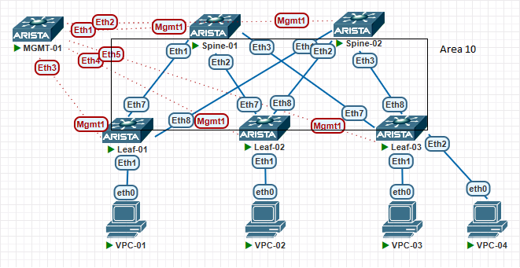

# Проектирование адресного пространства

## Цели работ

1. Настроить OSPF в Underlay сети, для IP связанности между всеми сетевыми устройствами.
2. Зафиксировать в документации - план работы, адресное пространство, схему сети, конфигурацию устройств
3. Убедиться в наличии IP связанности между устройствами в OSFP домене

## Выполнение Работ

### Топология

Реализованная схема:\


### Настройки OSPF

<details>
<summary>Spine's</summary>
<br>
router ospf 1 <br>
   passive-interface default <br>
   no passive-interface Ethernet1 <br>
   no passive-interface Ethernet2 <br>
   no passive-interface Ethernet3 <br>
   redistribute connected route-map RM_OSPF_OUT <br>
   max-lsa 12000 <br>
<br>
interface Ethernet1 <br>
   description --- Leaf-01 --- <br>
   ip ospf neighbor bfd <br>
   ip ospf network point-to-point <br>
   ip ospf area 0.0.0.10 <br>
<br>
interface Ethernet2 <br>
   description --- Leaf-02 --- <br>
   ip ospf neighbor bfd <br>
   ip ospf network point-to-point <br>
   ip ospf area 0.0.0.10 <br>
<br>
interface Ethernet3 <br>
   description --- Leaf-03 --- <br>
   ip ospf neighbor bfd <br>
   ip ospf network point-to-point <br>
   ip ospf area 0.0.0.10 <br>
<br>
route-map RM_OSPF_OUT permit 1 <br>
   match ip address prefix-list PL_OSPF_OUT <br>
<br>
ip prefix-list PL_OSPF_OUT seq 10 permit 10.1X.255.1/32<br>
Где X номер Spine коммутатора в схеме <br>
</details>

<details>
<summary>Leaf's</summary>
<br>
router ospf 1 <br>
   passive-interface default <br>
   no passive-interface Ethernet7 <br>
   no passive-interface Ethernet8 <br>
   redistribute connected route-map RM_OSPF_OUT <br>
   max-lsa 12000 <br>
<br>
interface Ethernet7 <br>
   description --- Spine-01 --- <br>
   ip ospf neighbor bfd <br>
   ip ospf network point-to-point <br>
   ip ospf area 0.0.0.10 <br>
<br>
interface Ethernet8 <br>
   description --- Spine-02 --- <br>
   ip ospf neighbor bfd <br>
   ip ospf network point-to-point <br>
   ip ospf area 0.0.0.10 <br>
<br>
route-map RM_OSPF_OUT permit 1 <br>
   match ip address prefix-list PL_OSPF_OUT <br>
<br>
ip prefix-list PL_OSPF_OUT seq 10 permit 10.2X.255.1/32<br>
Где X номер Leaf коммутатора в схеме <br>
</details>

### Проверка IP связности

### Spine-01

``` Spine-01
Spine-01#sh ip ospf neighbor
Neighbor ID     Instance VRF      Pri State                  Dead Time   Address         Interface
10.201.1.1      1        default  0   FULL                   00:00:31    10.11.1.2       Ethernet1
10.202.1.1      1        default  0   FULL                   00:00:29    10.11.2.2       Ethernet2
10.203.1.1      1        default  0   FULL                   00:00:33    10.11.3.2       Ethernet3

Spine-01#sh bfd peers
VRF name: default
-----------------
DstAddr        MyDisc    YourDisc  Interface/Transport    Type          LastUp
---------- ----------- ----------- -------------------- ------- ---------------
10.11.1.2  1559515881  3988456240        Ethernet1(13)  normal  11/30/24 17:07
10.11.2.2  4099456841  2216118393        Ethernet2(14)  normal  11/30/24 17:20
10.11.3.2    90821037  3674536677        Ethernet3(15)  normal  11/30/24 17:21

   LastDown            LastDiag    State
-------------- ------------------- -----
         NA       No Diagnostic       Up
         NA       No Diagnostic       Up
         NA       No Diagnostic       Up

Spine-01#sh ip route  ospf
 O        10.12.1.0/30 [110/20] via 10.11.1.2, Ethernet1
 O        10.12.2.0/30 [110/20] via 10.11.2.2, Ethernet2
 O        10.12.3.0/30 [110/20] via 10.11.3.2, Ethernet3
 O E2     10.12.255.1/32 [110/1] via 10.11.1.2, Ethernet1
                                 via 10.11.2.2, Ethernet2
                                 via 10.11.3.2, Ethernet3
 O E2     10.21.255.1/32 [110/1] via 10.11.1.2, Ethernet1
 O E2     10.22.255.1/32 [110/1] via 10.11.2.2, Ethernet2
 O E2     10.23.255.1/32 [110/1] via 10.11.3.2, Ethernet3

### PING ###
Spine-01#ping 10.21.255.1 repeat 1 ### Leaf-01
80 bytes from 10.21.255.1: icmp_seq=1 ttl=64 time=4.53 ms

Spine-01#ping 10.22.255.1 repeat 1 ### Leaf-02
80 bytes from 10.22.255.1: icmp_seq=1 ttl=64 time=5.31 ms

Spine-01#ping 10.23.255.1 repeat 1 ### Leaf-03
80 bytes from 10.23.255.1: icmp_seq=1 ttl=64 time=3.80 ms

Spine-01#ping 10.12.255.1 repeat 1 ### Spine-01
80 bytes from 10.12.255.1: icmp_seq=1 ttl=63 time=9.94 ms
```

### Spine-02

``` Spine-02
Spine-02#sh ip ospf neighbor
Neighbor ID     Instance VRF      Pri State                  Dead Time   Address         Interface
10.201.1.1      1        default  0   FULL                   00:00:36    10.12.1.2       Ethernet1
10.202.1.1      1        default  0   FULL                   00:00:30    10.12.2.2       Ethernet2
10.203.1.1      1        default  0   FULL                   00:00:29    10.12.3.2       Ethernet3


Spine-02#sh bfd peers
VRF name: default
-----------------
DstAddr        MyDisc    YourDisc  Interface/Transport    Type          LastUp
---------- ----------- ----------- -------------------- ------- ---------------
10.12.1.2  2104791323  1740865348        Ethernet1(13)  normal  11/30/24 17:15
10.12.2.2  3371597205  2221587133        Ethernet2(14)  normal  11/30/24 17:20
10.12.3.2  1701472467  2067415280        Ethernet3(15)  normal  11/30/24 17:21

   LastDown            LastDiag    State
-------------- ------------------- -----
         NA       No Diagnostic       Up
         NA       No Diagnostic       Up
         NA       No Diagnostic       Up

Spine-02#sh ip route ospf
 O        10.11.1.0/30 [110/20] via 10.12.1.2, Ethernet1
 O        10.11.2.0/30 [110/20] via 10.12.2.2, Ethernet2
 O        10.11.3.0/30 [110/20] via 10.12.3.2, Ethernet3
 O E2     10.11.255.1/32 [110/1] via 10.12.1.2, Ethernet1
                                 via 10.12.2.2, Ethernet2
                                 via 10.12.3.2, Ethernet3
 O E2     10.21.255.1/32 [110/1] via 10.12.1.2, Ethernet1
 O E2     10.22.255.1/32 [110/1] via 10.12.2.2, Ethernet2
 O E2     10.23.255.1/32 [110/1] via 10.12.3.2, Ethernet3

### PING ###
Spine-02#ping 10.21.255.1  repeat 1 ### Leaf-01
80 bytes from 10.21.255.1: icmp_seq=1 ttl=64 time=5.24 ms

Spine-02#ping 10.22.255.1  repeat 1 ### Leaf-02
80 bytes from 10.22.255.1: icmp_seq=1 ttl=64 time=4.96 ms
 
Spine-02#ping 10.23.255.1  repeat 1 ### Leaf-03
80 bytes from 10.23.255.1: icmp_seq=1 ttl=64 time=6.06 ms

Spine-02#ping 10.11.255.1  repeat 1 ### Spine-01
80 bytes from 10.11.255.1: icmp_seq=1 ttl=63 time=8.75 ms
```
