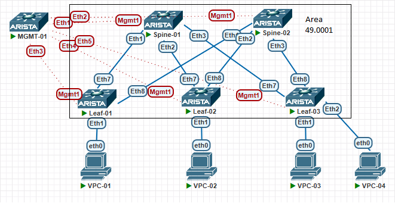

# Настройка ISIS в Underlay

## Цели работ

1. Настроите ISIS в Underlay сети, для IP связанности между всеми сетевыми устройствами.
2. Зафиксировать в документации - план работы, адресное пространство, схему сети, конфигурацию устройств
3. Убедиться в наличии IP связанности между устройствами в ISIS домене

## Выполнение Работ

### Топология

Реализованная схема:


### [Адресное Пространство](/Lab01/README.md#%D0%B0%D0%B4%D1%80%D0%B5%D1%81%D0%BD%D0%BE%D0%B5-%D0%BF%D1%80%D0%BE%D1%81%D1%82%D1%80%D0%B0%D0%BD%D1%81%D1%82%D0%B2%D0%BE)

### Настройки ISIS

<details>
<summary>Spine's</summary>
<br>
router isis KITEZH <br>
   net 49.0001.0001.0001.000X.00 <br>
   ! <br>
   address-family ipv4 unicast <br>
<br>
interface Ethernet1 <br>
   description --- Leaf-01 --- <br>
   isis enable KITEZH <br>
   isis bfd <br>
<br>
interface Ethernet2 <br>
   description --- Leaf-02 --- <br>
   isis enable KITEZH <br>
   isis bfd <br>
<br>
interface Ethernet3 <br>
   description --- Leaf-03 --- <br>
   isis enable KITEZH <br>
   isis bfd <br>
<br>
interface Loopback0 <br>
  isis enable KITEZH <br>
<br>
Где X номер Spine коммутатора в схеме <br>
</details>

<details>
<summary>Leaf's</summary>
<br>
router isis KITEZH <br>
   net 49.0001.0001.0002.000Y.00 <br>
   ! <br>
   address-family ipv4 unicast <br>
<br>
interface Ethernet7 <br>
   description --- Spine-01 --- <br>
   isis enable KITEZH <br>
   isis bfd <br>
<br>
interface Ethernet8 <br>
   description --- Spine-02 --- <br>
   isis enable KITEZH <br>
   isis bfd <br>
<br>
interface Loopback0 <br>
  isis enable KITEZH <br>
<br>
Где Y номер Leaf коммутатора в схеме <br>
</details>

### Проверка IP связности

### Spine-01

``` Spine-01
Spine-01#sh isis neighbors
Instance  VRF      System Id        Type Interface          SNPA              State Hold time   Circuit Id
KITEZH    default  Leaf-01          L1   Ethernet1          50:0:ac:b4:80:59  UP    27          Spine-01.0f
KITEZH    default  Leaf-01          L2   Ethernet1          50:0:ac:b4:80:59  UP    28          Spine-01.0f
KITEZH    default  Leaf-02          L1   Ethernet2          50:59:58:47:be:14 UP    30          Spine-01.10
KITEZH    default  Leaf-02          L2   Ethernet2          50:59:58:47:be:14 UP    22          Spine-01.10
KITEZH    default  Leaf-03          L1   Ethernet3          50:4d:7d:ff:ee:e5 UP    28          Spine-01.11
KITEZH    default  Leaf-03          L2   Ethernet3          50:4d:7d:ff:ee:e5 UP    22          Spine-01.11


Spine-01#sh bfd peers
VRF name: default
-----------------
DstAddr        MyDisc    YourDisc  Interface/Transport    Type          LastUp
---------- ----------- ----------- -------------------- ------- ---------------
10.11.1.2  3182397699  1133648687        Ethernet1(15)  normal  11/30/24 18:40
10.11.2.2  2257389071  1391023222        Ethernet2(16)  normal  11/30/24 18:49
10.11.3.2  1289604156   152355148        Ethernet3(17)  normal  11/30/24 18:51

   LastDown            LastDiag    State
-------------- ------------------- -----
         NA       No Diagnostic       Up
         NA       No Diagnostic       Up
         NA       No Diagnostic       Up


Spine-01#sh ip route isis
 I L1     10.12.1.0/30 [115/20] via 10.11.1.2, Ethernet1
 I L1     10.12.2.0/30 [115/20] via 10.11.2.2, Ethernet2
 I L1     10.12.3.0/30 [115/20] via 10.11.3.2, Ethernet3
 I L1     10.12.255.1/32 [115/30] via 10.11.1.2, Ethernet1
                                  via 10.11.2.2, Ethernet2
                                  via 10.11.3.2, Ethernet3
 I L1     10.21.255.1/32 [115/20] via 10.11.1.2, Ethernet1
 I L1     10.22.255.1/32 [115/20] via 10.11.2.2, Ethernet2
 I L1     10.23.255.1/32 [115/20] via 10.11.3.2, Ethernet3


### LOOPBACK PING ###
### Leaf-01
Spine-01#ping 10.21.255.1 repeat 1 
80 bytes from 10.21.255.1: icmp_seq=1 ttl=64 time=4.53 ms

### Leaf-02
Spine-01#ping 10.22.255.1 repeat 1 
80 bytes from 10.22.255.1: icmp_seq=1 ttl=64 time=5.31 ms

### Leaf-03
Spine-01#ping 10.23.255.1 repeat 1 
80 bytes from 10.23.255.1: icmp_seq=1 ttl=64 time=3.80 ms

### Spine-02
Spine-01#ping 10.12.255.1 repeat 1 
80 bytes from 10.12.255.1: icmp_seq=1 ttl=63 time=9.94 ms
```

### Spine-02

``` Spine-02
Spine-02#sh isis neighbors
Instance  VRF      System Id        Type Interface          SNPA              State Hold time
KITEZH    default  Leaf-01          L1   Ethernet1          50:0:ac:b4:80:59  UP    28
KITEZH    default  Leaf-01          L2   Ethernet1          50:0:ac:b4:80:59  UP    29
KITEZH    default  Leaf-02          L1   Ethernet2          50:59:58:47:be:14 UP    9
KITEZH    default  Leaf-02          L2   Ethernet2          50:59:58:47:be:14 UP    9
KITEZH    default  Leaf-03          L1   Ethernet3          50:4d:7d:ff:ee:e5 UP    7
KITEZH    default  Leaf-03          L2   Ethernet3          50:4d:7d:ff:ee:e5 UP    7


Spine-02#sh bfd peers
VRF name: default
-----------------
DstAddr        MyDisc    YourDisc  Interface/Transport    Type          LastUp
---------- ----------- ----------- -------------------- ------- ---------------
10.12.1.2  2017224285  3833958468        Ethernet1(13)  normal  11/30/24 18:53
10.12.2.2  2269395687   602051689        Ethernet2(14)  normal  11/30/24 18:53
10.12.3.2  2002387184  3882910188        Ethernet3(15)  normal  11/30/24 18:53

   LastDown            LastDiag    State
-------------- ------------------- -----
         NA       No Diagnostic       Up
         NA       No Diagnostic       Up
         NA       No Diagnostic       Up


Spine-02#sh ip route isis
 I L1     10.11.1.0/30 [115/20] via 10.12.1.2, Ethernet1
 I L1     10.11.2.0/30 [115/20] via 10.12.2.2, Ethernet2
 I L1     10.11.3.0/30 [115/20] via 10.12.3.2, Ethernet3
 I L1     10.11.255.1/32 [115/30] via 10.12.1.2, Ethernet1
                                  via 10.12.2.2, Ethernet2
                                  via 10.12.3.2, Ethernet3
 I L1     10.21.255.1/32 [115/20] via 10.12.1.2, Ethernet1
 I L1     10.22.255.1/32 [115/20] via 10.12.2.2, Ethernet2
 I L1     10.23.255.1/32 [115/20] via 10.12.3.2, Ethernet3


### LOOPBACK PING ###
### Leaf-01
Spine-02#ping 10.21.255.1  repeat 1 
80 bytes from 10.21.255.1: icmp_seq=1 ttl=64 time=5.24 ms

### Leaf-02
Spine-02#ping 10.22.255.1  repeat 1 
80 bytes from 10.22.255.1: icmp_seq=1 ttl=64 time=4.96 ms
 
### Leaf-03
Spine-02#ping 10.23.255.1  repeat 1 
80 bytes from 10.23.255.1: icmp_seq=1 ttl=64 time=6.06 ms

### Spine-01
Spine-02#ping 10.11.255.1  repeat 1 
80 bytes from 10.11.255.1: icmp_seq=1 ttl=63 time=8.75 ms
```
