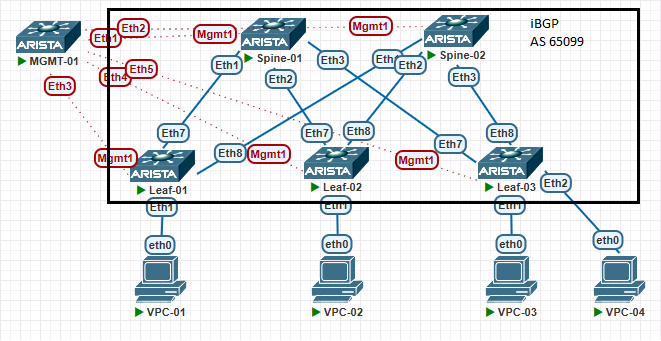

# Настройка BGP в Underlay

## Цели работ

1. Настроить iBGP в Underlay сети, для IP связанности между всеми сетевыми устройствами.
2. Зафиксировать в документации - план работы, адресное пространство, схему сети, конфигурацию устройств
3. Убедиться в наличии IP связанности между устройствами в BGP домене

## Выполнение Работ

### Топология

Реализованная схема:


### [Адресное Пространство](/Lab01/README.md#%D0%B0%D0%B4%D1%80%D0%B5%D1%81%D0%BD%D0%BE%D0%B5-%D0%BF%D1%80%D0%BE%D1%81%D1%82%D1%80%D0%B0%D0%BD%D1%81%D1%82%D0%B2%D0%BE)

### Настройки BGP

<details>
<summary>Spine's</summary>
<br>
router bgp 65099<br>
   maximum-paths 4 ecmp 64<br>
   neighbor LEAF_GROUP peer group<br>
   neighbor LEAF_GROUP remote-as 65099<br>
   neighbor LEAF_GROUP next-hop-self<br>
   neighbor LEAF_GROUP bfd<br>
   neighbor LEAF_GROUP route-reflector-client<br>
   neighbor LEAF_GROUP route-map RM_BGP_IN in<br><br>
   neighbor LEAF_GROUP route-map RM_BGP_OUT out<br>
   neighbor 10.1X.1.2 peer group LEAF_GROUP<br>
   neighbor 10.1X.2.2 peer group LEAF_GROUP<br>
   neighbor 10.1X.3.2 peer group LEAF_GROUP<br>
   network 10.1X.255.1/32<br>
<br>
Где X номер Spine коммутатора в схеме <br>
</details>

<details>
<summary>Leaf's</summary>
<br>
router bgp 65099 <br>
   maximum-paths 4 ecmp 64 <br>
   neighbor SPINE_GROUP peer group <br>
   neighbor SPINE_GROUP remote-as 65099 <br>
   neighbor SPINE_GROUP bfd <br>
   neighbor SPINE_GROUP route-map RM_BGP_IN in <br>
   neighbor SPINE_GROUP route-map RM_BGP_OUT out <br>
   neighbor 10.1X.1.1 peer group SPINE_GROUP <br>
   neighbor 10.1X.1.1 peer group SPINE_GROUP <br>
   network 10.2Y.255.1/32 <br>
<br>
Где X номер Spine коммутатора в схеме <br>
Где Y номер Leaf коммутатора в схеме <br>
</details>

### Проверка IP связности

### Spine-01

``` Spine-01
Spine-01#sh ip bgp summary
BGP summary information for VRF default
Router identifier 10.11.255.1, local AS number 65099
Neighbor Status Codes: m - Under maintenance
  Neighbor         V  AS           MsgRcvd   MsgSent  InQ OutQ  Up/Down State   PfxRcd PfxAcc
  10.11.1.2        4  65099            180       203    0    0 00:45:44 Estab   1      1
  10.11.2.2        4  65099            105       123    0    0 00:45:44 Estab   1      1
  10.11.3.2        4  65099            109       130    0    0 00:45:44 Estab   1      1


Spine-01#sh bfd peers
VRF name: default
-----------------
DstAddr        MyDisc    YourDisc  Interface/Transport    Type          LastUp
---------- ----------- ----------- -------------------- ------- ---------------
10.11.1.2  3574109738  3196169754        Ethernet1(13)  normal  01/15/25 10:38
10.11.2.2  1161384979  2046438866        Ethernet2(14)  normal  01/15/25 11:46
10.11.3.2   104474651  1701063509        Ethernet3(15)  normal  01/15/25 11:46


Spine-01#sh ip route bgp
 B I      10.21.255.1/32 [200/0] via 10.11.1.2, Ethernet1
 B I      10.22.255.1/32 [200/0] via 10.11.2.2, Ethernet2
 B I      10.23.255.1/32 [200/0] via 10.11.3.2, Ethernet3


### LOOPBACK PING ###
### Leaf-01
Spine-01#ping 10.21.255.1 repeat 1 
80 bytes from 10.21.255.1: icmp_seq=1 ttl=64 time=4.53 ms

### Leaf-02
Spine-01#ping 10.22.255.1 repeat 1 
80 bytes from 10.22.255.1: icmp_seq=1 ttl=64 time=5.31 ms

### Leaf-03
Spine-01#ping 10.23.255.1 repeat 1 
80 bytes from 10.23.255.1: icmp_seq=1 ttl=64 time=3.80 ms
```

### Spine-02

``` Spine-02
Spine-02#sh ip bgp summary
BGP summary information for VRF default
Router identifier 10.12.255.1, local AS number 65099
Neighbor Status Codes: m - Under maintenance
  Neighbor         V  AS           MsgRcvd   MsgSent  InQ OutQ  Up/Down State   PfxRcd PfxAcc
  10.12.1.2        4  65099             50        52    0    0 00:45:35 Estab   1      1
  10.12.2.2        4  65099             49        51    0    0 00:44:54 Estab   1      1
  10.12.3.2        4  65099             49        51    0    0 00:44:05 Estab   1      1


Spine-02#sh bfd peers
VRF name: default
-----------------
DstAddr        MyDisc   YourDisc  Interface/Transport    Type           LastUp
---------- ----------- ---------- -------------------- ------- ----------------
10.12.1.2  3157275367  359779152        Ethernet1(15)  normal   01/15/25 12:16
10.12.2.2   589079944  882697793        Ethernet2(16)  normal   01/15/25 12:17
10.12.3.2   629739505   87197158        Ethernet3(17)  normal   01/15/25 12:17


Spine-02#sh ip route bgp
 B I      10.21.255.1/32 [200/0] via 10.12.1.2, Ethernet1
 B I      10.22.255.1/32 [200/0] via 10.12.2.2, Ethernet2
 B I      10.23.255.1/32 [200/0] via 10.12.3.2, Ethernet3


### LOOPBACK PING ###
### Leaf-01
Spine-02#ping 10.21.255.1  repeat 1 
80 bytes from 10.21.255.1: icmp_seq=1 ttl=64 time=5.24 ms

### Leaf-02
Spine-02#ping 10.22.255.1  repeat 1 
80 bytes from 10.22.255.1: icmp_seq=1 ttl=64 time=4.96 ms
 
### Leaf-03
Spine-02#ping 10.23.255.1  repeat 1 
80 bytes from 10.23.255.1: icmp_seq=1 ttl=64 time=6.06 ms
```

### Leaf's

```Leaf's
Leaf-0Y#sh ip bgp summary
BGP summary information for VRF default
Router identifier 10.201.1.1, local AS number 65099
Neighbor Status Codes: m - Under maintenance
  Neighbor         V  AS           MsgRcvd   MsgSent  InQ OutQ  Up/Down State   PfxRcd PfxAcc
  10.11.Y.1        4  65099            212       194    0    0 00:50:14 Estab   3      3
  10.12.Y.1        4  65099             54        52    0    0 00:47:54 Estab   3      3
  
Leaf-01#sh bfd peers
VRF name: default
-----------------
DstAddr        MyDisc    YourDisc  Interface/Transport    Type          LastUp
---------- ----------- ----------- -------------------- ------- ---------------
10.11.Y.1  3196169754  3574109738        Ethernet7(21)  normal  01/15/25 10:38
10.12.Y.1   359779152  3157275367        Ethernet8(22)  normal  01/15/25 12:16

Leaf-0Y#sh ip route bgp
 B I      10.11.255.1/32 [200/0] via 10.11.Y.1, Ethernet7
 B I      10.12.255.1/32 [200/0] via 10.12.Y.1, Ethernet8
 B I      10.22.255.1/32 [200/0] via 10.11.Y.1, Ethernet7
 B I      10.23.255.1/32 [200/0] via 10.11.Y.1, Ethernet7

### LOOPBACK PING ###
### Leaf-01
Leaf-0Y#ping 10.21.255.1 source lo0 repeat 1
PING 10.21.255.1 (10.21.255.1) from 10.22.255.1 : 72(100) bytes of data.
80 bytes from 10.21.255.1: icmp_seq=1 ttl=63 time=8.25 ms
--- 10.21.255.1 ping statistics ---
1 packets transmitted, 1 received, 0% packet loss, time 0ms
rtt min/avg/max/mdev = 8.252/8.252/8.252/0.000 ms

### Leaf-02
Leaf-0Y#ping 10.22.255.1 source lo0 repeat 1
PING 10.22.255.1 (10.22.255.1) from 10.22.255.1 : 72(100) bytes of data.
80 bytes from 10.22.255.1: icmp_seq=1 ttl=64 time=0.055 ms
--- 10.22.255.1 ping statistics ---
1 packets transmitted, 1 received, 0% packet loss, time 0ms
rtt min/avg/max/mdev = 0.055/0.055/0.055/0.000 ms

### Leaf-03
Leaf-0Y#ping 10.23.255.1 source lo0 repeat 1
PING 10.23.255.1 (10.23.255.1) from 10.22.255.1 : 72(100) bytes of data.
80 bytes from 10.23.255.1: icmp_seq=1 ttl=63 time=11.9 ms
--- 10.23.255.1 ping statistics ---
1 packets transmitted, 1 received, 0% packet loss, time 0ms
rtt min/avg/max/mdev = 11.984/11.984/11.984/0.000 ms

### Spine-01
Leaf-0Y#ping 10.11.255.1 source lo0 repeat 1
PING 10.11.255.1 (10.11.255.1) from 10.22.255.1 : 72(100) bytes of data.
80 bytes from 10.11.255.1: icmp_seq=1 ttl=64 time=3.86 ms
--- 10.11.255.1 ping statistics ---
1 packets transmitted, 1 received, 0% packet loss, time 0ms
rtt min/avg/max/mdev = 3.861/3.861/3.861/0.000 ms

### Spine-02
Leaf-0Y#ping 10.12.255.1 source lo0 repeat 1
PING 10.12.255.1 (10.12.255.1) from 10.22.255.1 : 72(100) bytes of data.
80 bytes from 10.12.255.1: icmp_seq=1 ttl=64 time=5.75 ms
--- 10.12.255.1 ping statistics ---
1 packets transmitted, 1 received, 0% packet loss, time 0ms
rtt min/avg/max/mdev = 5.756/5.756/5.756/0.000 ms
```
