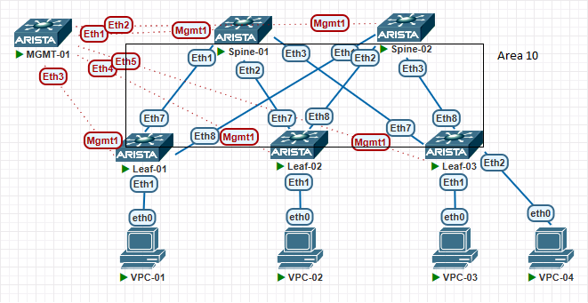
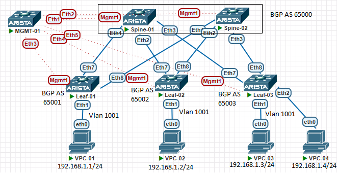

# VxLAN. L2 VNI

## Цели работ

1. Настроить BGP peering между Leaf и Spine в AF l2vpn evpn
2. Настроить связанность между клиентами в первой зоне и убедитесь в её наличии
3. Зафиксировать в документации - план работы, адресное пространство, схему сети, конфигурацию устройств

## Выполнение Работ

### Топология

Реализованная схема OSPF:



Реализованная схема BGP EVPN:



### [Адресное Пространство](/Lab01/README.md#%D0%B0%D0%B4%D1%80%D0%B5%D1%81%D0%BD%D0%BE%D0%B5-%D0%BF%D1%80%D0%BE%D1%81%D1%82%D1%80%D0%B0%D0%BD%D1%81%D1%82%D0%B2%D0%BE)

### Настройки OSPF в Underlay

<details>
<summary>Spine's</summary>
<br>
router ospf 1 <br>
   router-id 10.1X.255.1 <br>
   passive-interface default <br>
   no passive-interface Ethernet1 <br>
   no passive-interface Ethernet2 <br>
   no passive-interface Ethernet3 <br>
   redistribute connected route-map RM_OSPF_OUT <br>
   max-lsa 12000 <br>
<br>
interface Ethernet1 <br>
   description --- Leaf-01 --- <br>
   ip ospf neighbor bfd <br>
   ip ospf network point-to-point <br>
   ip ospf area 0.0.0.10 <br>
<br>
interface Ethernet2 <br>
   description --- Leaf-02 --- <br>
   ip ospf neighbor bfd <br>
   ip ospf network point-to-point <br>
   ip ospf area 0.0.0.10 <br>
<br>
interface Ethernet3 <br>
   description --- Leaf-03 --- <br>
   ip ospf neighbor bfd <br>
   ip ospf network point-to-point <br>
   ip ospf area 0.0.0.10 <br>
<br>
route-map RM_OSPF_OUT permit 1 <br>
   match ip address prefix-list PL_OSPF_OUT <br>
<br>
ip prefix-list PL_OSPF_OUT seq 10 permit 10.1X.255.1/32<br>
Где X номер Spine коммутатора в схеме <br>
</details>
<details>
<summary>Leaf's</summary>
<br>
router bgp 65099 <br>
   maximum-paths 4 ecmp 64 <br>
   neighbor SPINE_GROUP peer group <br>
   neighbor SPINE_GROUP remote-as 65099 <br>
   neighbor SPINE_GROUP bfd <br>
   neighbor SPINE_GROUP route-map RM_BGP_IN in <br>
   neighbor SPINE_GROUP route-map RM_BGP_OUT out <br>
   neighbor 10.1X.1.1 peer group SPINE_GROUP <br>
   neighbor 10.1X.1.1 peer group SPINE_GROUP <br>
   network 10.2Y.255.1/32 <br>
<br>
Где X номер Spine коммутатора в схеме <br>
Где Y номер Leaf коммутатора в схеме <br>
</details>

### Настройка BGP в Overlay

<details>
    <summary>Spine's</summary>
    <br>
    router bgp 65000<br>
     maximum-paths 2 ecmp 64<br>
   neighbor EVPN peer group<br>
   neighbor EVPN update-source Loopback0<br>
   neighbor EVPN ebgp-multihop 3<br>
   neighbor EVPN send-community extended<br>
   neighbor EVPN maximum-routes 12000 warning-only<br>
   neighbor 10.21.255.1 peer group EVPN<br>
   neighbor 10.21.255.1 remote-as 65001<br>
   neighbor 10.22.255.1 peer group EVPN<br>
   neighbor 10.22.255.1 remote-as 65002<br>
   neighbor 10.23.255.1 peer group EVPN<br>
   neighbor 10.23.255.1 remote-as 65003<br>
   !<br>
   address-family evpn<br>
      neighbor EVPN activate<br>
</details>

<details>
    <summary>Leaf's</summary>
    router bgp 6500Y<br>
    maximum-paths 2 ecmp 64<br>
   neighbor EVPN peer group<br>
   neighbor EVPN remote-as 65000<br>
   neighbor EVPN update-source Loopback0<br>
   neighbor EVPN ebgp-multihop 3<br>
   neighbor EVPN send-community extended<br>
   neighbor EVPN maximum-routes 12000 warning-only<br>
   neighbor 10.11.255.1 peer group EVPN<br>
   neighbor 10.12.255.1 peer group EVPN<br>
   !<br>
   vlan 1001<br>
      rd 6500Y:10001<br>
      route-target both 1001:10001<br>
      redistribute learned<br>
   !<br>
   address-family evpn<br>
      neighbor EVPN activate<br>
   !<br>
   address-family ipv4<br>
      network 10.20Y.1.1/32<br><br>
    Где Y номер Leaf в схеме<br>
</details>

### Настройка VXLAN интерфейса на Leaf

interface Vxlan1
   vxlan source-interface Loopback1
   vxlan udp-port 4789
   vxlan vlan 1001 vni 10001
   vxlan learn-restrict any

### Таблица VLAN и VNI

|Vlan Name|Vlan ID|VNI|
|---|---|---|
|Customer-01|1001|10001|

### BGP EVPN связность

#### Leaf-01

``` Leaf-01
Leaf-01#sh bgp evpn summary
BGP summary information for VRF default
Router identifier 10.201.1.1, local AS number 65001
Neighbor Status Codes: m - Under maintenance
  Neighbor    V AS           MsgRcvd   MsgSent  InQ OutQ  Up/Down State   PfxRcd PfxAcc
  10.11.255.1 4 65000             54        54    0    0 00:30:40 Estab   2      2
  10.12.255.1 4 65000             30        35    0    0 00:13:33 Estab   2      2
```

#### Leaf-02

``` Leaf-02
Leaf-02#sh bgp evpn summary
BGP summary information for VRF default
Router identifier 10.202.1.1, local AS number 65002
Neighbor Status Codes: m - Under maintenance
  Neighbor    V AS           MsgRcvd   MsgSent  InQ OutQ  Up/Down State   PfxRcd PfxAcc
  10.11.255.1 4 65000             45        50    0    0 00:27:39 Estab   2      2
  10.12.255.1 4 65000             31        34    0    0 00:14:47 Estab   2      2
```

#### Leaf-03

``` Leaf-03
Leaf-03#sh bgp evpn summary
BGP summary information for VRF default
Router identifier 10.203.1.1, local AS number 65003
Neighbor Status Codes: m - Under maintenance
  Neighbor    V AS           MsgRcvd   MsgSent  InQ OutQ  Up/Down State   PfxRcd PfxAcc
  10.11.255.1 4 65000             31        32    0    0 00:13:12 Estab   2      2
  10.12.255.1 4 65000             32        35    0    0 00:13:12 Estab   2      2
```

#### Spine-01

``` Spine-01
Spine-01#sh bgp evpn summary
BGP summary information for VRF default
Router identifier 10.11.255.1, local AS number 65000
Neighbor Status Codes: m - Under maintenance
  Neighbor    V AS           MsgRcvd   MsgSent  InQ OutQ  Up/Down State   PfxRcd PfxAcc
  10.21.255.1 4 65001             57        56    0    0 00:33:09 Estab   1      1
  10.22.255.1 4 65002             51        47    0    0 00:28:53 Estab   1      1
  10.23.255.1 4 65003             34        32    0    0 00:14:07 Estab   1      1
```

#### Spine-02

``` Spine-02
Spine-02#sh bgp evpn summary
BGP summary information for VRF default
Router identifier 10.12.255.1, local AS number 65000
Neighbor Status Codes: m - Under maintenance
  Neighbor    V AS           MsgRcvd   MsgSent  InQ OutQ  Up/Down State   PfxRcd PfxAcc
  10.21.255.1 4 65001             38        34    0    0 00:16:35 Estab   1      1
  10.22.255.1 4 65002             37        34    0    0 00:16:35 Estab   1      1
  10.23.255.1 4 65003             36        34    0    0 00:14:40 Estab   1      1
```

### Проверка связности между ПК в VLAN 1001

#### PC-01

``` PC-01
NAME   IP/MASK              GATEWAY
PC-01  192.168.1.1/24       192.168.1.254

PC-01> ping 192.168.1.2
192.168.1.2 icmp_seq=1 timeout
84 bytes from 192.168.1.2 icmp_seq=2 ttl=64 time=16.916 ms
84 bytes from 192.168.1.2 icmp_seq=3 ttl=64 time=16.892 ms

PC-01> ping 192.168.1.3
84 bytes from 192.168.1.3 icmp_seq=1 ttl=64 time=18.481 ms
84 bytes from 192.168.1.3 icmp_seq=2 ttl=64 time=16.170 ms

PC-01> ping 192.168.1.4
84 bytes from 192.168.1.4 icmp_seq=1 ttl=64 time=18.664 ms
84 bytes from 192.168.1.4 icmp_seq=2 ttl=64 time=17.266 ms
```

#### PC-02

``` PC-02
NAME   IP/MASK              GATEWAY
PC-02  192.168.1.2/24       192.168.1.254

PC-02> ping 192.168.1.1
84 bytes from 192.168.1.1 icmp_seq=1 ttl=64 time=26.210 ms
84 bytes from 192.168.1.1 icmp_seq=2 ttl=64 time=26.329 ms

PC-02> ping 192.168.1.3
84 bytes from 192.168.1.3 icmp_seq=1 ttl=64 time=32.864 ms
84 bytes from 192.168.1.3 icmp_seq=2 ttl=64 time=15.952 ms

PC-02> ping 192.168.1.4
84 bytes from 192.168.1.4 icmp_seq=1 ttl=64 time=23.631 ms
84 bytes from 192.168.1.4 icmp_seq=2 ttl=64 time=23.613 ms
```

#### PC-03/04

``` PC-03
NAME   IP/MASK              GATEWAY
PC-03  192.168.1.3/24       192.168.1.254

PC-03> ping 192.168.1.1
84 bytes from 192.168.1.1 icmp_seq=1 ttl=64 time=30.804 ms
84 bytes from 192.168.1.1 icmp_seq=2 ttl=64 time=17.050 ms


PC-03> ping 192.168.1.2
84 bytes from 192.168.1.2 icmp_seq=1 ttl=64 time=19.336 ms
84 bytes from 192.168.1.2 icmp_seq=2 ttl=64 time=22.303 ms

PC-03> ping 192.168.1.4
84 bytes from 192.168.1.4 icmp_seq=1 ttl=64 time=7.132 ms
84 bytes from 192.168.1.4 icmp_seq=2 ttl=64 time=4.909 ms
```

### Пример команды sh bgp evpn с одного из лифов

``` Leaf-03
Leaf-03#sh bgp evpn
BGP routing table information for VRF default
Router identifier 10.203.1.1, local AS number 65003
Route status codes: * - valid, > - active, S - Stale, E - ECMP head, e - ECMP
                    c - Contributing to ECMP, % - Pending BGP convergence
Origin codes: i - IGP, e - EGP, ? - incomplete
AS Path Attributes: Or-ID - Originator ID, C-LST - Cluster List, LL Nexthop - Link Local Nexthop

          Network                Next Hop              Metric  LocPref Weight  Path
 * >Ec    RD: 65001:10001 mac-ip 0050.7966.688a
                                 10.201.1.1            -       100     0       65000 65001 i
 *  ec    RD: 65001:10001 mac-ip 0050.7966.688a
                                 10.201.1.1            -       100     0       65000 65001 i
 * >Ec    RD: 65002:10001 mac-ip 0050.7966.688b
                                 10.202.1.1            -       100     0       65000 65002 i
 *  ec    RD: 65002:10001 mac-ip 0050.7966.688b
                                 10.202.1.1            -       100     0       65000 65002 i
 * >      RD: 65003:10001 mac-ip 0050.7966.688c
                                 -                     -       -       0       i
 * >      RD: 65003:10001 mac-ip 0050.7966.688d
                                 -                     -       -       0       i
 * >Ec    RD: 65001:10001 imet 10.201.1.1
                                 10.201.1.1            -       100     0       65000 65001 i
 *  ec    RD: 65001:10001 imet 10.201.1.1
                                 10.201.1.1            -       100     0       65000 65001 i
 * >Ec    RD: 65002:10001 imet 10.202.1.1
                                 10.202.1.1            -       100     0       65000 65002 i
 *  ec    RD: 65002:10001 imet 10.202.1.1
                                 10.202.1.1            -       100     0       65000 65002 i
 * >      RD: 65003:10001 imet 10.203.1.1
                                 -                     -       -       0       i
```
