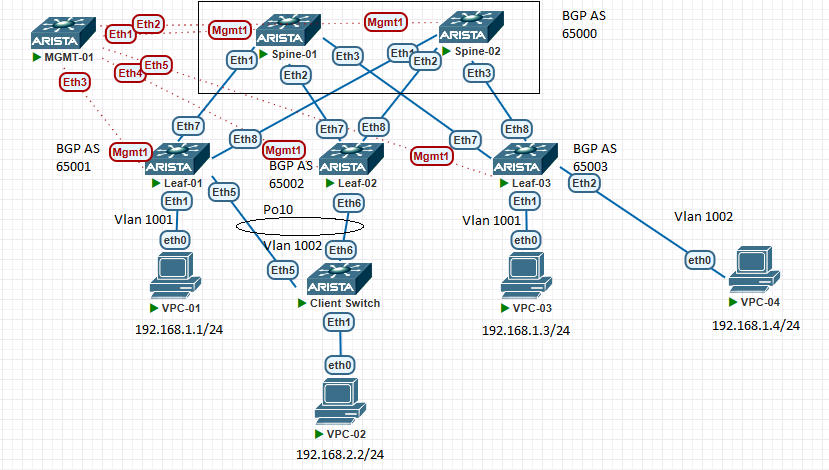

# VXLAN. Multihoming

## Цели работ

1. Подключить клиента 2-я линками к различным Leaf
2. Настроить агрегированный канал со стороны клиента
3. Настроить multihoming для работы в Overlay сети.
4. Зафиксируеть в документации - план работы, адресное пространство, схему сети, конфигурацию устройств
5. Протестировать отказоустойчивость - убедиться, что связнность не теряется при отключении одного из линков

## Выполнение Работ

### Топология

Реализованная схема OSPF:


Реализованная схема BGP EVPN:



### [Адресное Пространство](/Lab01/README.md#%D0%B0%D0%B4%D1%80%D0%B5%D1%81%D0%BD%D0%BE%D0%B5-%D0%BF%D1%80%D0%BE%D1%81%D1%82%D1%80%D0%B0%D0%BD%D1%81%D1%82%D0%B2%D0%BE)

### Настройки OSPF в Underlay

<details>
<summary>Spine's</summary>
<br>
router ospf 1 <br>
   router-id 10.1X.255.1 <br>
   passive-interface default <br>
   no passive-interface Ethernet1 <br>
   no passive-interface Ethernet2 <br>
   no passive-interface Ethernet3 <br>
   redistribute connected route-map RM_OSPF_OUT <br>
   max-lsa 12000 <br>
<br>
interface Ethernet1 <br>
   description --- Leaf-01 --- <br>
   ip ospf neighbor bfd <br>
   ip ospf network point-to-point <br>
   ip ospf area 0.0.0.10 <br>
<br>
interface Ethernet2 <br>
   description --- Leaf-02 --- <br>
   ip ospf neighbor bfd <br>
   ip ospf network point-to-point <br>
   ip ospf area 0.0.0.10 <br>
<br>
interface Ethernet3 <br>
   description --- Leaf-03 --- <br>
   ip ospf neighbor bfd <br>
   ip ospf network point-to-point <br>
   ip ospf area 0.0.0.10 <br>
<br>
route-map RM_OSPF_OUT permit 1 <br>
   match ip address prefix-list PL_OSPF_OUT <br>
<br>
ip prefix-list PL_OSPF_OUT seq 10 permit 10.1X.255.1/32<br>
Где X номер Spine коммутатора в схеме <br>
</details>
<details>
<summary>Leaf's</summary>
<br>
router bgp 65099 <br>
   maximum-paths 4 ecmp 64 <br>
   neighbor SPINE_GROUP peer group <br>
   neighbor SPINE_GROUP remote-as 65099 <br>
   neighbor SPINE_GROUP bfd <br>
   neighbor SPINE_GROUP route-map RM_BGP_IN in <br>
   neighbor SPINE_GROUP route-map RM_BGP_OUT out <br>
   neighbor 10.1X.1.1 peer group SPINE_GROUP <br>
   neighbor 10.1X.1.1 peer group SPINE_GROUP <br>
   network 10.2Y.255.1/32 <br>
<br>
Где X номер Spine коммутатора в схеме <br>
Где Y номер Leaf коммутатора в схеме <br>
</details>

### Настройка BGP в Overlay

<details>
    <summary>Spine's</summary>
    <br>
    router bgp 65000<br>
     maximum-paths 2 ecmp 64<br>
   neighbor EVPN peer group<br>
   neighbor EVPN update-source Loopback0<br>
   neighbor EVPN ebgp-multihop 3<br>
   neighbor EVPN send-community extended<br>
   neighbor EVPN maximum-routes 12000 warning-only<br>
   neighbor 10.21.255.1 peer group EVPN<br>
   neighbor 10.21.255.1 remote-as 65001<br>
   neighbor 10.22.255.1 peer group EVPN<br>
   neighbor 10.22.255.1 remote-as 65002<br>
   neighbor 10.23.255.1 peer group EVPN<br>
   neighbor 10.23.255.1 remote-as 65003<br>
   !<br>
   address-family evpn<br>
      neighbor EVPN activate<br>
</details>
<details>
    <summary>Leaf's</summary>
    router bgp 6500Y<br>
    maximum-paths 2 ecmp 64<br>
   neighbor EVPN peer group<br>
   neighbor EVPN remote-as 65000<br>
   neighbor EVPN update-source Loopback0<br>
   neighbor EVPN ebgp-multihop 3<br>
   neighbor EVPN send-community extended<br>
   neighbor EVPN maximum-routes 12000 warning-only<br>
   neighbor 10.11.255.1 peer group EVPN<br>
   neighbor 10.12.255.1 peer group EVPN<br>
   !<br>
   vlan 1001<br>
      rd auto<br>
      route-target both 1001:10001<br>
      redistribute learned<br>
   !<br>
   vlan 1002<br>
      rd auto<br>
      route-target both 1002:10002<br>
      redistribute learned<br>
   !<br>
   address-family evpn<br>
      neighbor EVPN activate<br>
   !<br>
   address-family ipv4<br>
      network 10.20Y.1.1/32<br><br>
    Где Y номер Leaf в схеме<br>
</details>

### Настройка VXLAN интерфейса на Leaf

```vxlan
interface Vxlan1
   vxlan source-interface Loopback1
   vxlan udp-port 4789
   vxlan vlan 1001 vni 10001
   vxlan vlan 1002 vni 10002
   vxlan learn-restrict any
```

### Таблица VLAN и VNI

|Vlan Name|Vlan ID|VNI|
|---|---|---|
|Customer-01|1001|10001|
|Customer-02|1002|10002|

### Настройки VLAN интерфейсов на Leaf

``` Leaf's
interface Vlan1001
   description --- Customer-01 ---
   ip address virtual 192.168.1.254/24
   
interface Vlan1002
   description --- Customer-02 ---
   ip address virtual 192.168.2.254/24
```

### Настройки интерфейсов на Leaf и коммутаторе клиента

| Leaf            | Interface | Vlan | Endpoint                           |
| --------------- | --------- | ---- | ---------------------------------- |
| Leaf-01         | Ethernet1 | 1001 | PC-01                              |
| Leaf-02         | Ethernet1 | 1002 | ----                               |
| Leaf-02         | Ethernet5 | 1002 | Customer-02 Switch Port Channel 10 |
| Leaf-02         | Ethernet6 | 1002 | Customer-02 Switch Port Channel 10 |
| Leaf-03         | Ethernet1 | 1001 | PC-03                              |
| Leaf-03         | Ethernet2 | 1002 | PC-04                              |
| Customer-Switch | Ethernet1 | 1002 | PC-02                              |
| Customer-Switch | Ethernet5 | 1002 | Leaf-01 Port Channel 10            |
| Customer-Switch | Ethernet6 | 1002 | Leaf-02 Port Channel 10            |

### Настройка AnyCastGateway

```Virtual-mac
ip virtual-router mac-address 00:00:00:01:00:00
```

### Настройка MultiHome

``` Leaf-01
### Leaf 01

interface Ethernet5
   description --- Customer-02 Switch ---
   channel-group 10 mode active
   
interface Port-Channel10
   description --- Customer-02 Switch ---
   switchport access vlan 1002
   !
   evpn ethernet-segment
      identifier 0000:0001:0002:0005:0005
      route-target import 00:01:02:05:05:10
   lacp system-id 0001.0002.0000

Leaf-01#show bgp evpn instance vlan 1002
EVPN instance: VLAN 1002
  Route distinguisher: 0:0
  Route target import: Route-Target-AS:1002:10002
  Route target export: Route-Target-AS:1002:10002
  Service interface: VLAN-based
  Local VXLAN IP address: 10.201.1.1
  VXLAN: enabled
  MPLS: disabled
  Local ethernet segment:
    ESI: 0000:0001:0002:0005:0005
      Interface: Port-Channel10
      Mode: all-active
      State: up
      ES-Import RT: 00:01:02:05:05:10
      DF election algorithm: modulus
      Designated forwarder: 10.201.1.1
      Non-Designated forwarder: 10.202.1.1

### Leaf-02

interface Ethernet6
   description --- Customer-02 Switch ---
   channel-group 10 mode active

interface Port-Channel10
   description --- Customer-02 Switch ---
   switchport access vlan 1002
   !
   evpn ethernet-segment
      identifier 0000:0001:0002:0005:0005
      route-target import 00:01:02:05:05:10
   lacp system-id 0001.0002.0000

Leaf-02#show bgp evpn instance vlan 1002
EVPN instance: VLAN 1002
  Route distinguisher: 0:0
  Route target import: Route-Target-AS:1002:10002
  Route target export: Route-Target-AS:1002:10002
  Service interface: VLAN-based
  Local VXLAN IP address: 10.202.1.1
  VXLAN: enabled
  MPLS: disabled
  Local ethernet segment:
    ESI: 0000:0001:0002:0005:0005
      Interface: Port-Channel10
      Mode: all-active
      State: up
      ES-Import RT: 00:01:02:05:05:10
      DF election algorithm: modulus
      Designated forwarder: 10.201.1.1
      Non-Designated forwarder: 10.202.1.1

### Customer-Switch

interface Ethernet5
   description --- Leaf-01 ---
   channel-group 10 mode active
interface Ethernet6
   description --- Leaf-02 ---
   channel-group 10 mode active
interface Port-Channel10
   description --- Customer-02 ---
   switchport access vlan 1002

Customer-Switch#sh int status
Port       Name                Status       Vlan     Duplex Speed  Type            Flags Encapsulation
Et1                            connected    1002     full   1G     EbraTestPhyPort
Et2                            connected    1        full   1G     EbraTestPhyPort
Et3                            connected    1        full   1G     EbraTestPhyPort
Et4                            connected    1        full   1G     EbraTestPhyPort
Et5                            connected    in Po10  full   1G     EbraTestPhyPort
Et6                            connected    in Po10  full   1G     EbraTestPhyPort
Et7                            connected    1        full   1G     EbraTestPhyPort
Et8                            connected    1        full   1G     EbraTestPhyPort
Ma1                            notconnect   routed   auto   auto   10/100/1000
Po10       --- Customer-02 --- connected    1002     full   1G     N/A
```

### BGP EVPN связность

#### Leaf-01

``` Leaf-01
Leaf-01#sh bgp evpn summary
BGP summary information for VRF default
Router identifier 10.201.1.1, local AS number 65001
Neighbor Status Codes: m - Under maintenance
  Neighbor    V AS           MsgRcvd   MsgSent  InQ OutQ  Up/Down State   PfxRcd PfxAcc
  10.11.255.1 4 65000           5087      5083    0    0    2d23h Estab   10     10
  10.12.255.1 4 65000           5058      5073    0    0    2d23h Estab   10     10
```

#### Leaf-02

``` Leaf-02
Leaf-02#sh bgp evpn summary
BGP summary information for VRF default
Router identifier 10.202.1.1, local AS number 65002
Neighbor Status Codes: m - Under maintenance
  Neighbor    V AS           MsgRcvd   MsgSent  InQ OutQ  Up/Down State   PfxRcd PfxAcc
  10.11.255.1 4 65000           5076      5075    0    0    2d23h Estab   10     10
  10.12.255.1 4 65000           5069      5065    0    0    2d23h Estab   10     10
```

#### Leaf-03

``` Leaf-03
Leaf-03#sh bgp evpn summary
BGP summary information for VRF default
Router identifier 10.203.1.1, local AS number 65003
Neighbor Status Codes: m - Under maintenance
  Neighbor    V AS           MsgRcvd   MsgSent  InQ OutQ  Up/Down State   PfxRcd PfxAcc
  10.11.255.1 4 65000           5066      5060    0    0    2d23h Estab   4      4
  10.12.255.1 4 65000           5065      5070    0    0    2d23h Estab   4      4
```

#### Spine-01

``` Spine-01
Spine-01#sh bgp evpn summary
BGP summary information for VRF default
Router identifier 10.11.255.1, local AS number 65000
Neighbor Status Codes: m - Under maintenance
  Neighbor    V AS           MsgRcvd   MsgSent  InQ OutQ  Up/Down State   PfxRcd PfxAcc
  10.21.255.1 4 65001           5087      5089    0    0    2d23h Estab   2      2
  10.22.255.1 4 65002           5078      5079    0    0    2d23h Estab   2      2
  10.23.255.1 4 65003           5060      5066    0    0    2d23h Estab   2      2
```

#### Spine-02

``` Spine-02
Spine-02#sh bgp evpn summary
BGP summary information for VRF default
Router identifier 10.12.255.1, local AS number 65000
Neighbor Status Codes: m - Under maintenance
  Neighbor    V AS           MsgRcvd   MsgSent  InQ OutQ  Up/Down State   PfxRcd PfxAcc
  10.21.255.1 4 65001           5079      5062    0    0    2d23h Estab   2      2
  10.22.255.1 4 65002           5070      5072    0    0    2d23h Estab   2      2
  10.23.255.1 4 65003           5070      5066    0    0    2d23h Estab   2      2
```

### Проверка связности между ПК

#### PC-01 (1001 VLAN) и PC-02 (1002 VLAN за Customer-Switch Po10)

``` PC-01
NAME   IP/MASK              GATEWAY
PC-01  192.168.1.1/24       192.168.1.254
PC-02  192.168.2.2/24       192.168.2.254


### Включены оба порта Port Channel 10
Leaf-01#sh int po10 status
Port       Name                       Status       Vlan     Duplex Speed  Type         Flags Encapsulation
Po10       --- Customer-02 Switch --- connected    1002     full   1G     N/A

Leaf-02#sh int po10 status
Port       Name                       Status       Vlan     Duplex Speed  Type         Flags Encapsulation
Po10       --- Customer-02 Switch --- connected    1002     full   1G     N/A

PC-01> ping 192.168.2.2
84 bytes from 192.168.2.2 icmp_seq=1 ttl=63 time=295.031 ms
84 bytes from 192.168.2.2 icmp_seq=2 ttl=63 time=20.336 ms
84 bytes from 192.168.2.2 icmp_seq=3 ttl=63 time=20.202 ms
84 bytes from 192.168.2.2 icmp_seq=4 ttl=63 time=20.471 ms


### Включен порт только на Leaf-01
Leaf-01#sh int po10 status
Port       Name                       Status       Vlan     Duplex Speed  Type         Flags Encapsulation
Po10       --- Customer-02 Switch --- connected    1002     full   1G     N/A

Leaf-02#sh int po10 status
Port       Name                       Status       Vlan     Duplex Speed  Type         Flags Encapsulation
Po10       --- Customer-02 Switch --- notconnect   1002     full   unconf N/A

PC-01> ping 192.168.2.2

84 bytes from 192.168.2.2 icmp_seq=1 ttl=63 time=20.921 ms
84 bytes from 192.168.2.2 icmp_seq=2 ttl=63 time=17.944 ms
84 bytes from 192.168.2.2 icmp_seq=3 ttl=63 time=16.812 ms
84 bytes from 192.168.2.2 icmp_seq=4 ttl=63 time=13.992 ms
84 bytes from 192.168.2.2 icmp_seq=5 ttl=63 time=88.484 ms


### Включен порт только на Leaf-02
Leaf-01#sh int po10 status
Port       Name                       Status       Vlan     Duplex Speed  Type         Flags Encapsulation
Po10       --- Customer-02 Switch --- notconnect   1002     full   unconf N/A

Leaf-02#sh int po10 status
Port       Name                       Status       Vlan     Duplex Speed  Type         Flags Encapsulation
Po10       --- Customer-02 Switch --- connected    1002     full   1G     N/A

PC-01> ping 192.168.2.2
84 bytes from 192.168.2.2 icmp_seq=1 ttl=63 time=35.437 ms
84 bytes from 192.168.2.2 icmp_seq=2 ttl=63 time=25.554 ms
84 bytes from 192.168.2.2 icmp_seq=3 ttl=63 time=23.661 ms
84 bytes from 192.168.2.2 icmp_seq=4 ttl=63 time=36.709 ms

```
