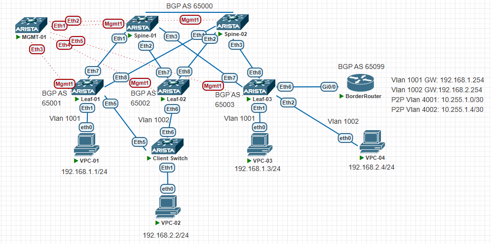

# VxLAN. Routing

## Цели работ

1. Разместить двух "клиентов" в разных VRF в рамках одной фабрики.
2. Настроить маршрутизацию между клиентами через внешнее устройство (граничный роутер\фаерволл\etc)
3. Зафиксировать в документации - план работы, адресное пространство, схему сети, настройки сетевого оборудования

## Выполнение Работ

### Топология

Реализованная схема OSPF:


Реализованная схема BGP EVPN:



### [Адресное Пространство](/Lab01/README.md#%D0%B0%D0%B4%D1%80%D0%B5%D1%81%D0%BD%D0%BE%D0%B5-%D0%BF%D1%80%D0%BE%D1%81%D1%82%D1%80%D0%B0%D0%BD%D1%81%D1%82%D0%B2%D0%BE)

### Настройки OSPF в Underlay

<details>
<summary>Spine's</summary>
<br>
router ospf 1 <br>
   router-id 10.1X.255.1 <br>
   passive-interface default <br>
   no passive-interface Ethernet1 <br>
   no passive-interface Ethernet2 <br>
   no passive-interface Ethernet3 <br>
   redistribute connected route-map RM_OSPF_OUT <br>
   max-lsa 12000 <br>
<br>
interface Ethernet1 <br>
   description --- Leaf-01 --- <br>
   ip ospf neighbor bfd <br>
   ip ospf network point-to-point <br>
   ip ospf area 0.0.0.10 <br>
<br>
interface Ethernet2 <br>
   description --- Leaf-02 --- <br>
   ip ospf neighbor bfd <br>
   ip ospf network point-to-point <br>
   ip ospf area 0.0.0.10 <br>
<br>
interface Ethernet3 <br>
   description --- Leaf-03 --- <br>
   ip ospf neighbor bfd <br>
   ip ospf network point-to-point <br>
   ip ospf area 0.0.0.10 <br>
<br>
route-map RM_OSPF_OUT permit 1 <br>
   match ip address prefix-list PL_OSPF_OUT <br>
<br>
ip prefix-list PL_OSPF_OUT seq 10 permit 10.1X.255.1/32<br>
Где X номер Spine коммутатора в схеме <br>
</details>
<details>
<summary>Leaf's</summary>
<br>
router bgp 65099 <br>
   maximum-paths 4 ecmp 64 <br>
   neighbor SPINE_GROUP peer group <br>
   neighbor SPINE_GROUP remote-as 65099 <br>
   neighbor SPINE_GROUP bfd <br>
   neighbor SPINE_GROUP route-map RM_BGP_IN in <br>
   neighbor SPINE_GROUP route-map RM_BGP_OUT out <br>
   neighbor 10.1X.1.1 peer group SPINE_GROUP <br>
   neighbor 10.1X.1.1 peer group SPINE_GROUP <br>
   network 10.2Y.255.1/32 <br>
<br>
Где X номер Spine коммутатора в схеме <br>
Где Y номер Leaf коммутатора в схеме <br>
</details>

### Настройка BGP в Overlay

<details>
    <summary>Spine's</summary>
    <br>
    router bgp 65000<br>
     maximum-paths 2 ecmp 64<br>
   neighbor EVPN peer group<br>
   neighbor EVPN update-source Loopback0<br>
   neighbor EVPN ebgp-multihop 3<br>
   neighbor EVPN send-community extended<br>
   neighbor EVPN maximum-routes 12000 warning-only<br>
   neighbor 10.21.255.1 peer group EVPN<br>
   neighbor 10.21.255.1 remote-as 65001<br>
   neighbor 10.22.255.1 peer group EVPN<br>
   neighbor 10.22.255.1 remote-as 65002<br>
   neighbor 10.23.255.1 peer group EVPN<br>
   neighbor 10.23.255.1 remote-as 65003<br>
   !<br>
   address-family evpn<br>
      neighbor EVPN activate<br>
</details>
<details>
    <Summary>Leaf's</Summary>
router bgp 6500Y<br>
   maximum-paths 2 ecmp 64<br>
   neighbor EVPN peer group<br>
   neighbor EVPN remote-as 65000<br>
   neighbor EVPN update-source Loopback0<br>
   neighbor EVPN ebgp-multihop 3<br>
   neighbor EVPN send-community extended<br>
   neighbor EVPN maximum-routes 12000 warning-only<br>
   neighbor 10.11.255.1 peer group EVPN<br>
   neighbor 10.12.255.1 peer group EVPN<br>
   !<br>
   vlan 1001<br>
      rd auto<br>
      route-target both 1001:10001<br>
      redistribute learned<br>
   !<br>
   vlan 1002<br>
      rd auto<br>
      route-target both 1002:10002<br>
      redistribute learned<br>
   !<br>
   address-family evpn<br>
      neighbor EVPN activate<br>
   !<br>
   address-family ipv4<br>
      network 10.20Y.1.1/32<br>
   !<br>
   vrf Customer-01<br>
      rd 10.20Y.1.1:4001<br>
      route-target import evpn 4001:4001<br>
      route-target export evpn 4001:4001<br>
      neighbor 10.255.1.2 remote-as 65099(Leaf 3 only)<br>
      !<br>
      address-family ipv4(Leaf 3 only)<br>
         neighbor 10.255.1.2 activate(Leaf 3 only)<br>
   !<br>
   vrf Customer-02<br>
      rd 10.20Y.1.1:4002<br>
      route-target import evpn 4002:4002<br>
      route-target export evpn 4002:4002<br>
      neighbor 10.255.1.6 remote-as 65099(Leaf 3 only)<br>
      !<br>
      address-family ipv4(Leaf 3 only)<br>
         neighbor 10.255.1.6 activate(Leaf 3 only)<br>
</details>

### Настройка VXLAN интерфейса на Leaf

```vxlan
interface Vxlan1
   vxlan source-interface Loopback1
   vxlan udp-port 4789
   vxlan vlan 1001 vni 10001
   vxlan vlan 1002 vni 10002
   vxlan vrf Customer-01 vni 4001
   vxlan vrf Customer-02 vni 4002
   vxlan learn-restrict any
```

### Таблица VLAN и VNI

|Vlan Name|Vlan ID|VNI|
|---|---|---|
|Customer-01|1001|10001|
|Customer-02|1002|10002|
|CUS-01-L3VNI|4001|4001|
|CUS-02-L3VNI|4002|4002|

### Таблица VRF

| VRF Имя     | Комментарий |
| ----------- | ----------- |
| Customer-01 | Клиент 1    |
| Customer-02 | Клиент 2    |

### Настройки VLAN интерфейсов на Leaf-03

``` Leaf's
interface Vlan4001
   vrf Customer-01
   ip address virtual 10.255.1.1/30

interface Vlan4002
   vrf Customer-02
   ip address virtual 10.255.1.5/30
```

### Настройки интерфейсов на Leaf и коммутаторе клиента

| Leaf            | Interface | Vlan  | Endpoint                           |
| --------------- | --------- | ----- | ---------------------------------- |
| Leaf-01         | Ethernet1 | 1001  | PC-01                              |
| Leaf-02         | Ethernet1 | 1002  | ----                               |
| Leaf-02         | Ethernet5 | 1002  | Customer-02 Switch Port Channel 10 |
| Leaf-02         | Ethernet6 | 1002  | Customer-02 Switch Port Channel 10 |
| Leaf-03         | Ethernet1 | 1001  | PC-03                              |
| Leaf-03         | Ethernet2 | 1002  | PC-04                              |
| Leaf-03         | Ethernet6 | Trunk | Trunk порт в сторону Border Router |
| Customer-Switch | Ethernet1 | 1002  | PC-02                              |
| Customer-Switch | Ethernet5 | 1002  | Leaf-01 Port Channel 10            |
| Customer-Switch | Ethernet6 | 1002  | Leaf-02 Port Channel 10            |

### Настройка AnyCastGateway

```Virtual-mac
ip virtual-router mac-address 00:00:00:01:00:00
```

### BGP EVPN связность

#### Leaf-01

``` Leaf-01
Leaf-01#sh bgp evpn summary
BGP summary information for VRF default
Router identifier 10.201.1.1, local AS number 65001
Neighbor Status Codes: m - Under maintenance
  Neighbor    V AS           MsgRcvd   MsgSent  InQ OutQ  Up/Down State   PfxRcd PfxAcc
  10.11.255.1 4 65000           3299      3342    0    0    1d19h Estab   19     19
  10.12.255.1 4 65000           3300      3334    0    0    1d19h Estab   19     19
```

#### Leaf-02

``` Leaf-02
Leaf-02#sh bgp evpn summary
BGP summary information for VRF default
Router identifier 10.202.1.1, local AS number 65002
Neighbor Status Codes: m - Under maintenance
  Neighbor    V AS           MsgRcvd   MsgSent  InQ OutQ  Up/Down State   PfxRcd PfxAcc
  10.11.255.1 4 65000           3276      3345    0    0    1d19h Estab   16     16
  10.12.255.1 4 65000           3291      3321    0    0    1d19h Estab   16     16
```

#### Leaf-03

``` Leaf-03
Leaf-03#sh bgp evpn summary
BGP summary information for VRF default
Router identifier 10.203.1.1, local AS number 65003
Neighbor Status Codes: m - Under maintenance
  Neighbor    V AS           MsgRcvd   MsgSent  InQ OutQ  Up/Down State   PfxRcd PfxAcc
  10.11.255.1 4 65000           1441      1541    0    0 01:57:17 Estab   9      9
  10.12.255.1 4 65000           1446      1554    0    0 01:57:17 Estab   9      9
```

#### Spine-01

``` Spine-01
Spine-01#sh bgp evpn summary
BGP summary information for VRF default
Router identifier 10.11.255.1, local AS number 65000
Neighbor Status Codes: m - Under maintenance
  Neighbor    V AS           MsgRcvd   MsgSent  InQ OutQ  Up/Down State   PfxRcd PfxAcc
  10.21.255.1 4 65001           8464      8422    0    0    1d19h Estab   3      3
  10.22.255.1 4 65002           8454      8390    0    0    1d19h Estab   6      6
  10.23.255.1 4 65003           8435      8380    0    0 01:56:11 Estab   13     13
```

#### Spine-02

``` Spine-02
Spine-02#sh bgp evpn summary
BGP summary information for VRF default
Router identifier 10.12.255.1, local AS number 65000
Neighbor Status Codes: m - Under maintenance
  Neighbor    V AS           MsgRcvd   MsgSent  InQ OutQ  Up/Down State   PfxRcd PfxAcc
  10.21.255.1 4 65001           8446      8399    0    0    1d19h Estab   3      3
  10.22.255.1 4 65002           8421      8399    0    0    1d19h Estab   6      6
  10.23.255.1 4 65003           8450      8371    0    0 01:56:35 Estab   13     13
```

### Конфигурация Border-Router

```BorderGateway
Border-Router#sh ip int br
Interface                  IP-Address      OK? Method Status                Protocol
GigabitEthernet0/0         unassigned      YES unset  up                    up
GigabitEthernet0/0.1001    192.168.1.254   YES manual up                    up
GigabitEthernet0/0.1002    192.168.2.254   YES manual up                    up
GigabitEthernet0/0.4001    10.255.1.2      YES manual up                    up
GigabitEthernet0/0.4002    10.255.1.6      YES manual up                    up
Loopback0                  10.255.255.255  YES manual up                    up
Loopback8                  8.8.8.8         YES manual up                    up

Border-Router#sh int desc
Interface                      Status         Protocol Description
Gi0/0.1001                     up             up       --- Vlan 1001 GW ---
Gi0/0.1002                     up             up       --- Vlan 1002 GW ---
Gi0/0.4001                     up             up       --- P2P L3 VNI Customer-01 ---
Gi0/0.4002                     up             up       --- P2P L3 VNI Customer-02 ---
Lo0                            up             up       --- Router ID ---
Lo8                            up             up       --- INET ---

Border-Router#sh run | sec interface
interface Loopback0
 description --- Router ID ---
 ip address 10.255.255.255 255.255.255.255
interface Loopback8
 description --- INET ---
 ip address 8.8.8.8 255.255.255.255
interface GigabitEthernet0/0
 no ip address
 duplex auto
 speed auto
 media-type rj45
interface GigabitEthernet0/0.1001
 description --- Vlan 1001 GW ---
 encapsulation dot1Q 1001
 ip address 192.168.1.254 255.255.255.0
interface GigabitEthernet0/0.1002
 description --- Vlan 1002 GW ---
 encapsulation dot1Q 1002
 ip address 192.168.2.254 255.255.255.0
interface GigabitEthernet0/0.4001
 description --- P2P L3 VNI Customer-01 ---
 encapsulation dot1Q 4001
 ip address 10.255.1.2 255.255.255.252
interface GigabitEthernet0/0.4002
 description --- P2P L3 VNI Customer-02 ---
 encapsulation dot1Q 4002
 ip address 10.255.1.6 255.255.255.252

Border-Router#sh run | sec router bgp
router bgp 65099
 bgp router-id 10.255.255.255
 bgp log-neighbor-changes
 neighbor CUSTOMERS peer-group
 neighbor 10.255.1.1 remote-as 65003
 neighbor 10.255.1.1 peer-group CUSTOMERS
 neighbor 10.255.1.5 remote-as 65003
 neighbor 10.255.1.5 peer-group CUSTOMERS
 !
 address-family ipv4
  network 0.0.0.0
  redistribute connected
  neighbor CUSTOMERS prefix-list BGP_OUT_DENY_P2P out
  neighbor 10.255.1.1 activate
  neighbor 10.255.1.5 activate
 exit-address-family

Border-Router#sh bgp sum
Neighbor        V           AS MsgRcvd MsgSent   TblVer  InQ OutQ Up/Down  State/PfxRcd
10.255.1.1      4        65003       9      13        8    0    0 00:05:32        0
10.255.1.5      4        65003       9      11        8    0    0 00:05:32        0

```

### BGP EVPN маршруты c Leaf-01

``` Leaf-01
Leaf-01#sh bgp evpn
BGP routing table information for VRF default
Router identifier 10.201.1.1, local AS number 65001
Route status codes: * - valid, > - active, S - Stale, E - ECMP head, e - ECMP
                    c - Contributing to ECMP, % - Pending BGP convergence
Origin codes: i - IGP, e - EGP, ? - incomplete
AS Path Attributes: Or-ID - Originator ID, C-LST - Cluster List, LL Nexthop - Link Local Nexthop

          Network                Next Hop              Metric  LocPref Weight  Path
 * >Ec    RD: 10.202.1.1:1002 auto-discovery 0 0000:0001:0002:0005:0005
                                 10.202.1.1            -       100     0       65000 65002 i
 *  ec    RD: 10.202.1.1:1002 auto-discovery 0 0000:0001:0002:0005:0005
                                 10.202.1.1            -       100     0       65000 65002 i
 * >Ec    RD: 10.202.1.1:1 auto-discovery 0000:0001:0002:0005:0005
                                 10.202.1.1            -       100     0       65000 65002 i
 *  ec    RD: 10.202.1.1:1 auto-discovery 0000:0001:0002:0005:0005
                                 10.202.1.1            -       100     0       65000 65002 i
 * >      RD: 10.201.1.1:1001 mac-ip 0050.7966.688a
                                 -                     -       -       0       i
 * >Ec    RD: 10.202.1.1:1002 mac-ip 0050.7966.688b
                                 10.202.1.1            -       100     0       65000 65002 i
 *  ec    RD: 10.202.1.1:1002 mac-ip 0050.7966.688b
                                 10.202.1.1            -       100     0       65000 65002 i
 * >Ec    RD: 10.203.1.1:1001 mac-ip 0050.7966.688c
                                 10.203.1.1            -       100     0       65000 65003 i
 *  ec    RD: 10.203.1.1:1001 mac-ip 0050.7966.688c
                                 10.203.1.1            -       100     0       65000 65003 i
 * >Ec    RD: 10.203.1.1:1001 mac-ip 509c.8b00.9000
                                 10.203.1.1            -       100     0       65000 65003 i
 *  ec    RD: 10.203.1.1:1001 mac-ip 509c.8b00.9000
                                 10.203.1.1            -       100     0       65000 65003 i
 * >Ec    RD: 10.203.1.1:1002 mac-ip 509c.8b00.9000
                                 10.203.1.1            -       100     0       65000 65003 i
 *  ec    RD: 10.203.1.1:1002 mac-ip 509c.8b00.9000
                                 10.203.1.1            -       100     0       65000 65003 i
 * >      RD: 10.201.1.1:1001 imet 10.201.1.1
                                 -                     -       -       0       i
 * >      RD: 10.201.1.1:1002 imet 10.201.1.1
                                 -                     -       -       0       i
 * >Ec    RD: 10.202.1.1:1001 imet 10.202.1.1
                                 10.202.1.1            -       100     0       65000 65002 i
 *  ec    RD: 10.202.1.1:1001 imet 10.202.1.1
                                 10.202.1.1            -       100     0       65000 65002 i
 * >Ec    RD: 10.202.1.1:1002 imet 10.202.1.1
                                 10.202.1.1            -       100     0       65000 65002 i
 *  ec    RD: 10.202.1.1:1002 imet 10.202.1.1
                                 10.202.1.1            -       100     0       65000 65002 i
 * >Ec    RD: 10.203.1.1:1001 imet 10.203.1.1
                                 10.203.1.1            -       100     0       65000 65003 i
 *  ec    RD: 10.203.1.1:1001 imet 10.203.1.1
                                 10.203.1.1            -       100     0       65000 65003 i
 * >Ec    RD: 10.203.1.1:1002 imet 10.203.1.1
                                 10.203.1.1            -       100     0       65000 65003 i
 *  ec    RD: 10.203.1.1:1002 imet 10.203.1.1
                                 10.203.1.1            -       100     0       65000 65003 i
 * >Ec    RD: 10.202.1.1:1 ethernet-segment 0000:0001:0002:0005:0005 10.202.1.1
                                 10.202.1.1            -       100     0       65000 65002 i
 *  ec    RD: 10.202.1.1:1 ethernet-segment 0000:0001:0002:0005:0005 10.202.1.1
                                 10.202.1.1            -       100     0       65000 65002 i
 * >Ec    RD: 10.203.1.1:4001 ip-prefix 0.0.0.0/0
                                 10.203.1.1            -       100     0       65000 65003 65099 i
 *  ec    RD: 10.203.1.1:4001 ip-prefix 0.0.0.0/0
                                 10.203.1.1            -       100     0       65000 65003 65099 i
 * >Ec    RD: 10.203.1.1:4002 ip-prefix 0.0.0.0/0
                                 10.203.1.1            -       100     0       65000 65003 65099 i
 *  ec    RD: 10.203.1.1:4002 ip-prefix 0.0.0.0/0
                                 10.203.1.1            -       100     0       65000 65003 65099 i
 * >Ec    RD: 10.203.1.1:4001 ip-prefix 8.8.8.8/32
                                 10.203.1.1            -       100     0       65000 65003 65099 ?
 *  ec    RD: 10.203.1.1:4001 ip-prefix 8.8.8.8/32
                                 10.203.1.1            -       100     0       65000 65003 65099 ?
 * >Ec    RD: 10.203.1.1:4002 ip-prefix 8.8.8.8/32
                                 10.203.1.1            -       100     0       65000 65003 65099 ?
 *  ec    RD: 10.203.1.1:4002 ip-prefix 8.8.8.8/32
                                 10.203.1.1            -       100     0       65000 65003 65099 ?
 * >Ec    RD: 10.203.1.1:4001 ip-prefix 192.168.1.0/24
                                 10.203.1.1            -       100     0       65000 65003 65099 ?
 *  ec    RD: 10.203.1.1:4001 ip-prefix 192.168.1.0/24
                                 10.203.1.1            -       100     0       65000 65003 65099 ?
 * >Ec    RD: 10.203.1.1:4002 ip-prefix 192.168.1.0/24
                                 10.203.1.1            -       100     0       65000 65003 65099 ?
 *  ec    RD: 10.203.1.1:4002 ip-prefix 192.168.1.0/24
                                 10.203.1.1            -       100     0       65000 65003 65099 ?
 * >Ec    RD: 10.203.1.1:4001 ip-prefix 192.168.2.0/24
                                 10.203.1.1            -       100     0       65000 65003 65099 ?
 *  ec    RD: 10.203.1.1:4001 ip-prefix 192.168.2.0/24
                                 10.203.1.1            -       100     0       65000 65003 65099 ?
 * >Ec    RD: 10.203.1.1:4002 ip-prefix 192.168.2.0/24
                                 10.203.1.1            -       100     0       65000 65003 65099 ?
 *  ec    RD: 10.203.1.1:4002 ip-prefix 192.168.2.0/24
                                 10.203.1.1            -       100     0       65000 65003 65099 ?
```

### Проверка связности между ПК

#### PC-01 (1001 VLAN) и PC-02 (1002 VLAN)

``` PC-01
NAME   IP/MASK              GATEWAY
PC-01  192.168.1.1/24       192.168.1.254
PC-02  192.168.2.2/24       192.168.2.254
PC-03  192.168.1.3/24       192.168.1.254

PC-01> ping 192.168.1.254
84 bytes from 192.168.1.254 icmp_seq=1 ttl=255 time=29.989 ms

PC-01> ping 192.168.1.3
84 bytes from 192.168.1.3 icmp_seq=1 ttl=64 time=20.005 ms

PC-01> ping 192.168.2.2
84 bytes from 192.168.2.2 icmp_seq=1 ttl=63 time=215.550 ms
84 bytes from 192.168.2.2 icmp_seq=1 ttl=63 time=62.497 ms
```
